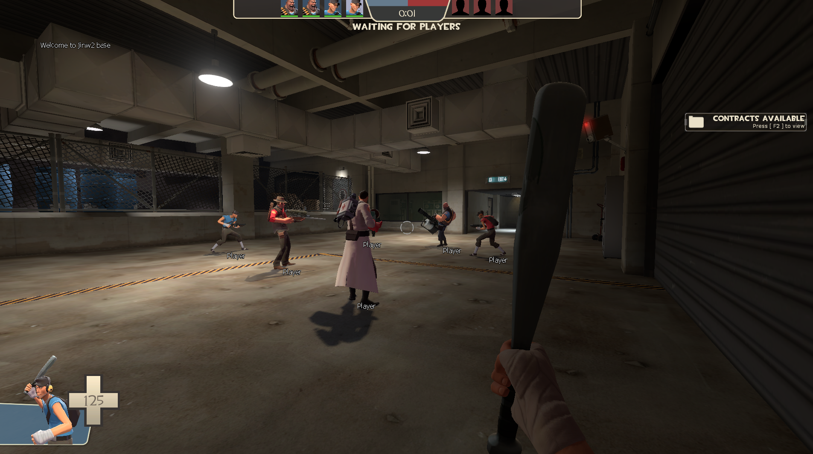

# jinw2

## Overview

`jinw2` is an example Team-Fortress 2 Lua-based internal trainer project. It exposes Source SDK functions that Lua script instances can call.

## Usage

1. Move Lua scripts (e.g., `example.lua`) into the `jinw2` directory within the AppData path.
2. Load the scripts into the target process using a library loader.

## Dependencies

- [sol2](https://github.com/ThePhD/sol2): A C++ library binding to Lua.
